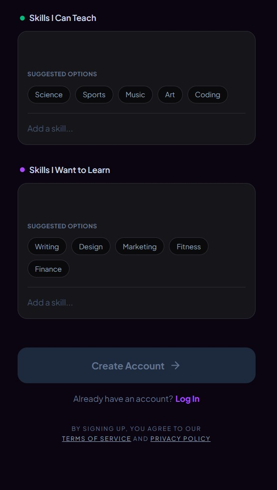
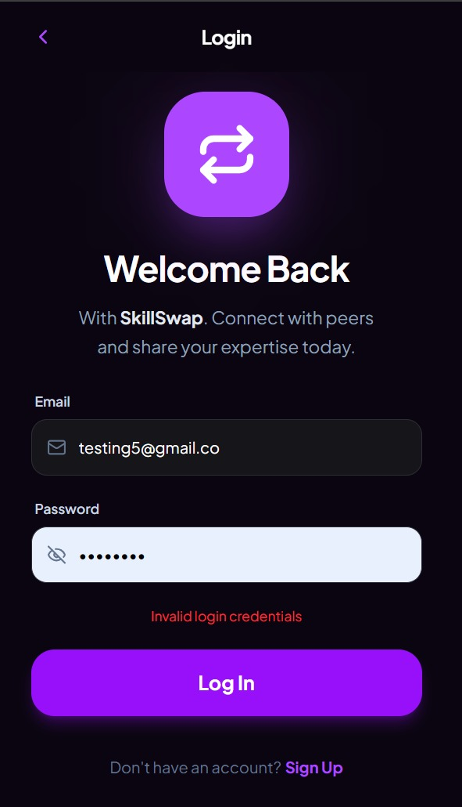
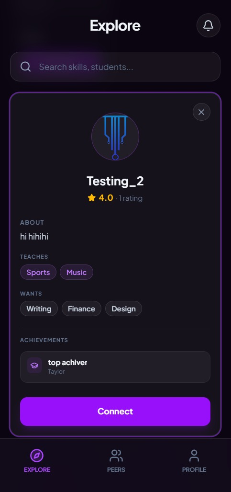
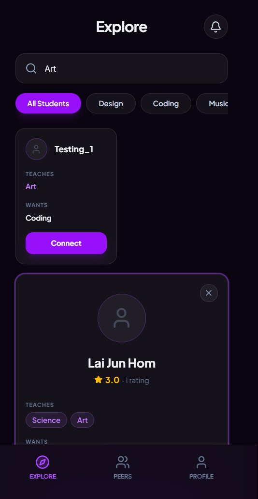
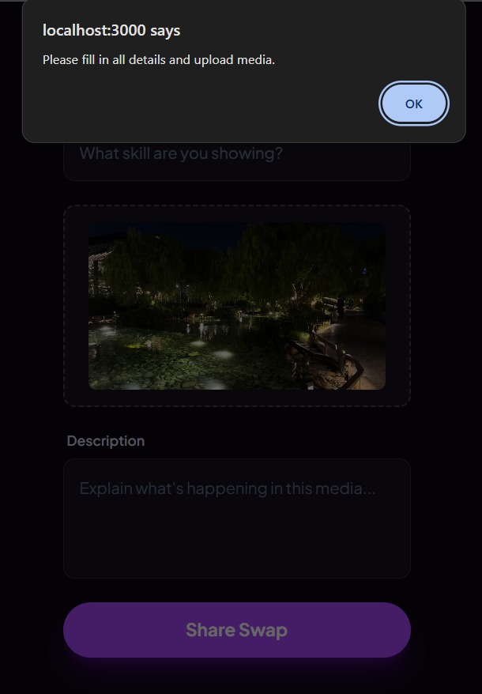
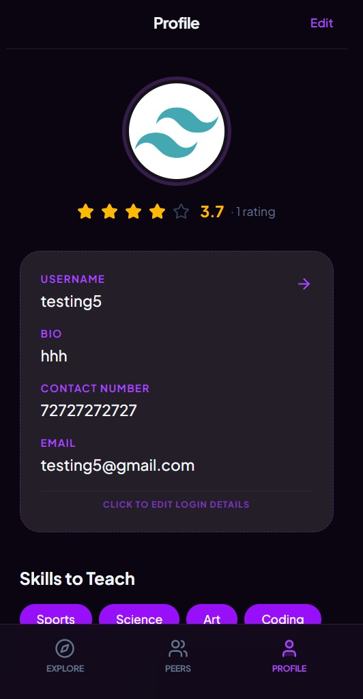

# Prototype Testing Notes

## Project: Peer Skill Swap

### Sign up

Test Case:
The system shall require users to select at least one skill they can teach and one skill they want to learn when creating an account.

### Login

Test Case:
The system shall display appropriate error messages for invalid login attempts.

### Explore

Test Case:
The Explore screen shall display available users and their skills, allowing the current user to discover potential skill swap partners.

### Search Bar

Test Case: 
The explore screen should display peers who teach "Art" only when the user searches for "Art".

### Swap Request Details

Test Case:
All users should be able to see their own "ratings" and the number of "ratings" in profile page.

### Rating

Test Case:
All users should be able to see their own "ratings" and the number of "ratings" in profile page.