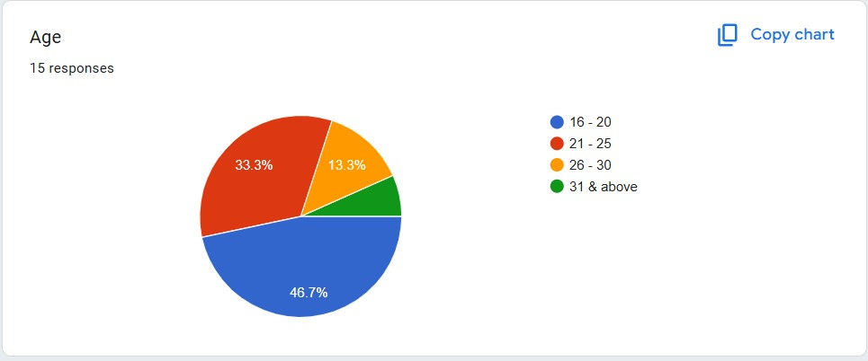
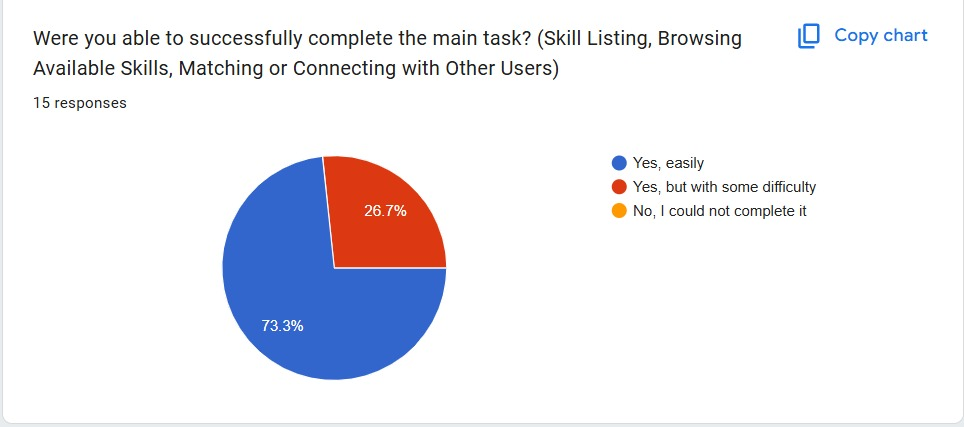
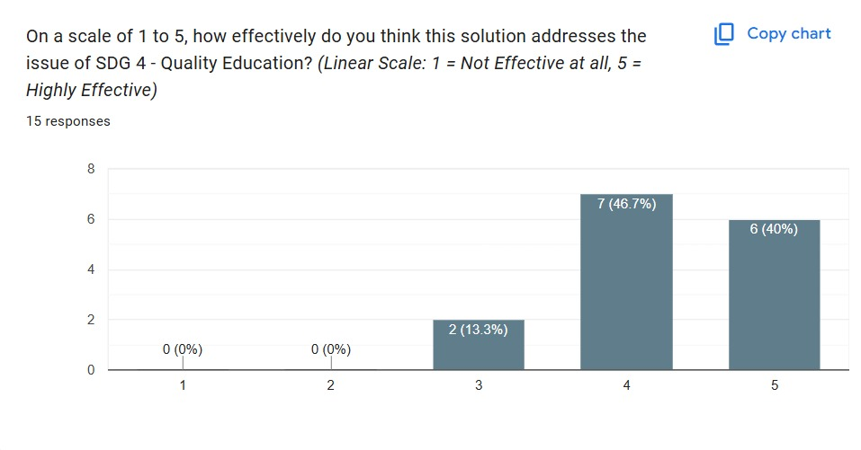

# Prototype Feedback Report

## Project: Peer Skill Swap

> [!NOTE]
> This document captures the feedback received during the prototype testing phase and outlines the next steps for implementation.

Google Form Link: https://docs.google.com/forms/d/e/1FAIpQLSfKZf_3NqndZGrLWQFqEn7kyPJP7zkh7RchsD-pXVua3hyKdg/viewform?usp=header

## Overview
*   **Prototype Version:** 1.0
*   **Testing Date:** March 2026
*   **Target Audience:** University Students

## Key Feedback Points
| Category | Observation | Impact |
| :--- | :--- | :--- |
| **UI/UX** | Users found the navigation menu slightly confusing. | High |
| **Features** | Request for a "Rating" system. | High |
| **Performance** | Loading times for the "Explore" page were slow. | Low |

---

## User Age Group Feedback (Diagrams)

## Usability & Experience

Most difficulty is in the part of using the prototype.
- Confusion about core concept and connection: Multiple responses indicated confusion regarding the "swap" concept and uncertainty about who to connect with or how to select a reliable person.
- Communication challenges: Difficulty was reported regarding how to communicate with other users.
- Usability issues: Issues were noted with some features creating bugs, specifically declining a request, and a general lack of words/labels for buttons in the prototype.
- Lack of awareness: One person was unaware of the notification feature.
- Ease of use: Some respondents found the application very easy to use or had no confusing/difficult parts.

Favourite about the solution
- User Experience: Many appreciated the solution's ease of use and user-friendly interface.
- Design & Aesthetics: Respondents liked the cool, good, and unique design of the solution.
- Networking & Skill Exchange: Users valued the ability to network with more people and trade skills for things they need, including learning for free.
- Skill Showcase: The ability to showcase their skills was also a positive aspect.

## Impact & Iteration

Suggest ONE specific thing about this app.
-  Reputation and Rating System: Many respondents requested adding a rating system, user scores, or reputation indicators to assess the reliability and trustworthiness of other users/peers.
- Feature Clarity and Detail: Feedback included suggestions to add descriptions explaining features and to make buttons more detailed for easier use.
- Communication and Notifications: One user suggested adding a chat box for peer communication, and another asked for a pop-up message for notifications.
- Functionality Fix: One user specifically mentioned needing to fix the decline request part.

Any other suggestions?
- Positive overall assessment: Many responses indicated the solution was "very good," "perfect," or "all good."
- Improvement suggestions: Suggestions centered on improving the UX and enhancing the UI which was considered "too simple."
- Feature recommendation: Adding a chat box was suggested to make the overall solution even better.
- Usability feedback: The need to make the solution easier to use with detailed information was mentioned.
- Minor issues: A general mention that a "few issues need to be fixed" was included.    

---